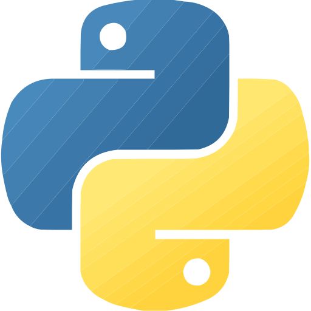
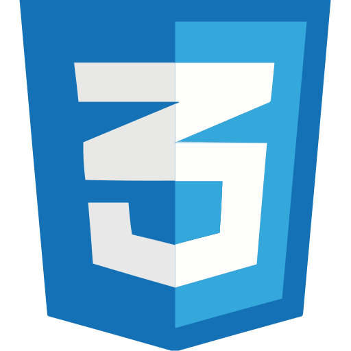
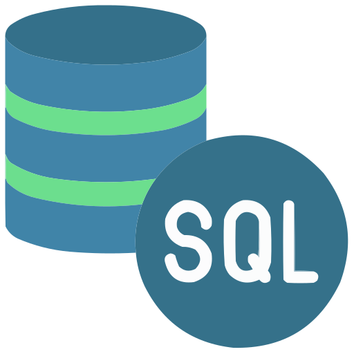
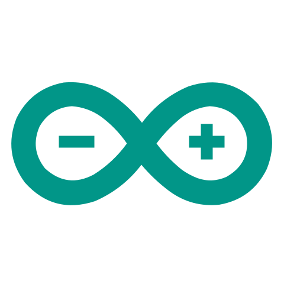

## Hello World! 

**Sou Samuel, Programador Jr e Estudante!**
- Atualmente cursando Análise e Desenvolvimento de Sistemas, buscando constante aprimoramento. 
Possuo experiência em projetos que envolvem Análise, filtragem e mapeamento de dados, Python e bibliotecas como pandas e selenium, C++ tendo como foco projetos em arduino, VBA para automações no Excel, e por fim JAVA, SQL e  por fim HTML/CSS/JavaScript que usei em projetos acadêmicos. Também tenho certificações em Cibersegurança, LGPD, Java e PowerBI.

##
**Trabalho ou já trabalhei com:**

 
  
  
  
  
  
  
  
  
  
  

 ##
 

   
  

